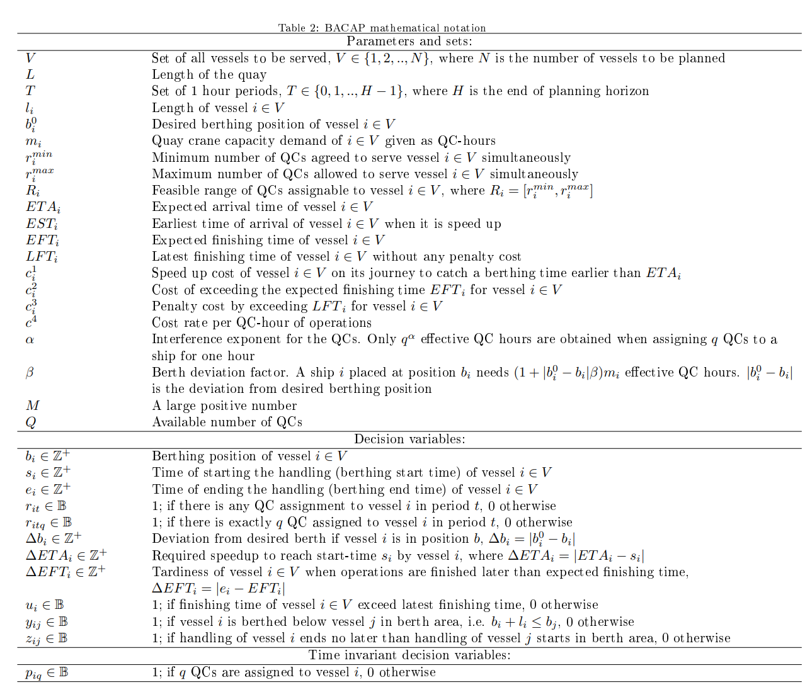
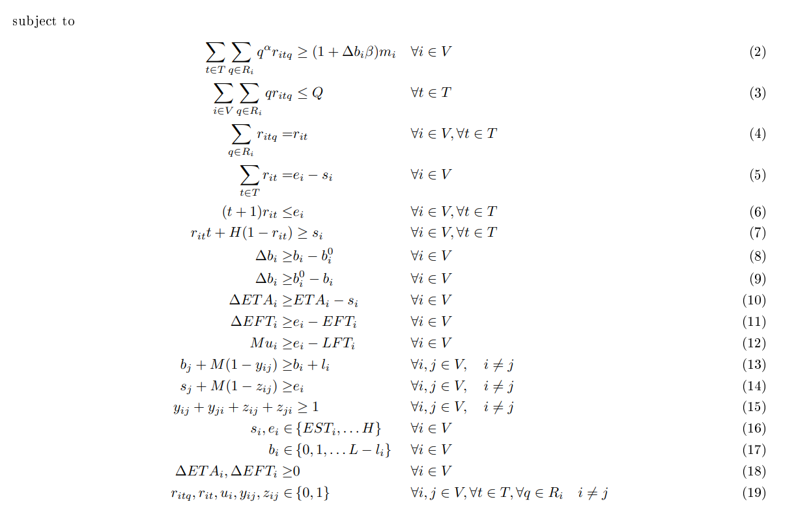

Berth allocation problem (BAP) is the allocation of certain vessels at the berth at a specific time during the time period of planning so that the vessel can carry out loading and unloading activities at the terminal

<!--more-->

## 问题定义

[berth allocation](https://en.wikipedia.org/wiki/Berth_allocation_problem)
- The **berth allocation problem** (also known as the berth scheduling problem) is a NP-complete problem in operations research, regarding the allocation of berth space for vessels in container terminals. Vessels arrive over time and the terminal operator needs to assign them to berths in order to be served (loading and unloading containers) as soon as possible. Different factors affect the berth and time assignment of each vessel.

## 港口实际情况及问题介绍

### 港口情况
港口图片

港口由港机和泊位两个部分组成，港机在港口可以沿着特定方向移动，船只可以停到泊位享受港机服务。

### 问题介绍

主体
1. 船舶
2. 泊位
3. 港机、岸桥、行车
4. 船舶货物

船舶到港口后需要一个泊位进行停靠，该泊位会有相应的一些港机能够对船只进行服务，船舶货物由于货物性质问题会需要特定的港机进行作业，因此会反向影响船舶对泊位的选择

问题可以被看做是一个二维装箱问题，纵坐标是泊位位置，横坐标是服务时间，每个矩形都是船舶停靠的位置和时间，内部小矩形是港机的服务个数，不过这里的箱子形状是可以变动的。

一个样例

## 问题分类

依据港口特性和实际情况一般有如下分类
1. 离散或连续停泊空间
2. 静态与动态船舶到达时间（静态所有船只已经在港口，动态只有一部分在
3. 静态与动态船舶装卸时间（静态装卸时间固定，动态可变

此问题涉及的维度有很多，包括船舶停靠的潮汐会影响船舶停靠时间、天气影响作业效率等

## 模型介绍

目标函数由两部分组成

1. 时间成本
   1. 早于ETA(expected time of arrival) --> speed up cost
   2. 晚于EFT(expected finishing time) --> delay cost
   3. 晚于LFT(latest finish time) --> ulterior penalty cost
2. 港机分配成本

参数

这部分模型的思想主要如下
1. 把时间变成可分的时间段
2. 把船舶对于货物的需求变成港机工作时间
3. 利用上面两个操作将港机变成一个个小积木，填充到大的矩形中

约束

约束2） 港机工作时间需求和完成这个工作时间的港机数量需求的对应
约束3） 港机数量不能超过最大
约束4） 数量统计
约束5）- 7） 工作时间与港机的对应，在矩形框内才能放港机
约束8）- 9） 偏移约束，这个感觉和我们的需求不太一样，可能是集装箱港口特有的东西
约束10） - 12） 时间约束
约束13） - 15） 船舶不能停在物理空间上重叠的地方，时间上也不能重叠

总体来看，这些约束能满足一部分的实际需求了，但可能和我现在的现场还是有些区别的，我们港口还涉及到船舶只能停某些特定的泊位，部分船舶靠离泊时间要看潮汐等。

下一步就是要把实际的现场问题刻画出来，同时预留货物种类这部分内容，等以后拓展仓储计划后，这两部分计划可能涉及到衔接的融合。

